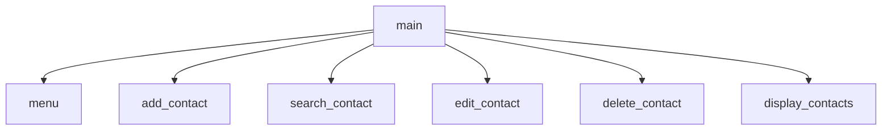

# Contact Manager with Menu

Programmed by Tate B. & Alex W.

## Description
This project includes an easy to use interface which allows the user to do the following tasks: Add contacts, edit contacts, search contacts, delete contacts, and show all contacts.

Each contact is to display the following information: Name, Address, Phone Number, and Email Address

## Flowchart

## IPO Charts

### Main Tate B.
| Arguments | Processing                                                      | Output/Return                                          |
| ------------------ | ------------- | ------------ |
| `none`   | takes choice from menu() and finds the proper function to call  | `Outputs` the function called from menu option.        |

### Menu Tate B.
| Arguments | Processing                                                      | Output/Return                                          |
| ------------------ | ------------- | ------------ |
| `none`    | takes choice from menu() and finds the proper function to call  | `Outputs` the function called from menu option.        |

### Add_Contact Alex W.
| Arguments | Processing                                                      | Output/Return                                          |
| ------------------ | ------------- | ------------ |
| `none`    | takes choice from menu() and finds the proper function to call  | `Outputs` the function called from menu option.        |

### Search_Contact Alex W.
| Arguments | Processing                                                      | Output/Return                                          |
| ------------------ | ------------- | ------------ |
| `none`    | takes choice from menu() and finds the proper function to call  | `Outputs` the function called from menu option.        |

### Display_Contacts Alex W.
| Arguments | Processing                                                      | Output/Return                                          |
| ------------------ | ------------- | ------------ |
| `none`    | takes choice from menu() and finds the proper function to call  | `Outputs` the function called from menu option.        |

### Delete_Contact Alex W.
| Arguments | Processing                                                      | Output/Return                                          |
| ------------------ | ------------- | ------------ |
| `none`    | takes choice from menu() and finds the proper function to call  | `Outputs` the function called from menu option.        |

### Edit_Contacts Tate B.
| Arguments | Processing                                                      | Output/Return                                          |
| ------------------ | ------------- | ------------ |
| `none`    | takes choice from menu() and finds the proper function to call  | `Outputs` the function called from menu option.        |
