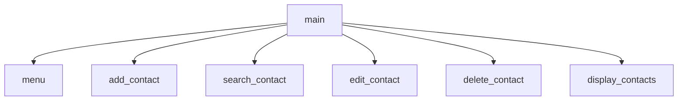

# Contact Manager with Menu

Programmed by Tate B. & ______

## Description
This project includes an easy to use interface which allows the user to do the following tasks: Add contacts, edit contacts, search contacts, delete contacts, and show all contacts.

Each contact is to display the following information: Name, Address, Phone Number, and Email Address

## Flowchart

## IPO Charts

### Main (Assigned to here)
| Arguments | Processing                                                      | Output/Return                                          |
| ------------------ | ------------- | ------------ |
| `none`   | takes choice from menu() and finds the proper function to call  | `Outputs` the function called from menu option.        |

### Menu (Assigned to here)
| Arguments | Processing                                                      | Output/Return                                          |
| ------------------ | ------------- | ------------ |
| `none`    | takes choice from menu() and finds the proper function to call  | `Outputs` the function called from menu option.        |

